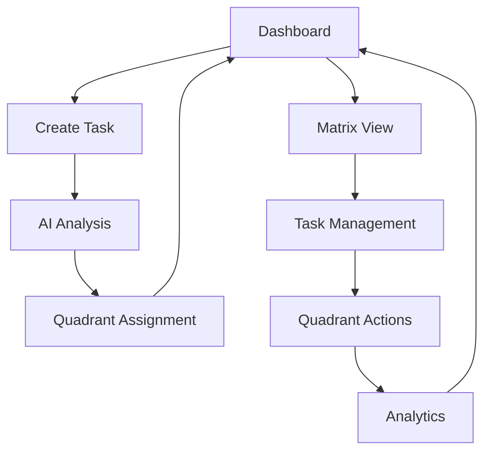

# Eisenhower Matrix Implementation Specification

## 1. Product Overview

The Eisenhower Matrix enhancement transforms the existing todo application into a sophisticated task prioritization system based on the proven productivity framework. This implementation categorizes tasks into four distinct quadrants based on urgency and importance levels, providing users with clear visual guidance and actionable recommendations for effective task management.

## 2. Core Features

### 2.1 User Roles

| Role | Registration Method | Core Permissions |
|------|---------------------|------------------|
| Authenticated User | Email registration via existing auth system | Full access to matrix features, task categorization, and AI recommendations |

### 2.2 Feature Module

Our Eisenhower Matrix implementation consists of the following enhanced pages:

1. **Dashboard Page**: Enhanced matrix visualization, quadrant-based task display, productivity insights
2. **Matrix View Page**: Full-screen matrix interface, drag-and-drop functionality, quadrant management
3. **Task Creation Page**: Enhanced AI categorization with urgency/importance analysis
4. **Analytics Page**: Matrix-based productivity metrics, time allocation insights

### 2.3 Page Details

| Page Name | Module Name | Feature Description |
|-----------|-------------|---------------------|
| Dashboard | Matrix Overview | Display tasks in 2x2 grid format with quadrant labels and color coding |
| Dashboard | Quick Actions | Provide quadrant-specific action buttons (Do, Schedule, Delegate, Delete) |
| Dashboard | Task Counter | Show task distribution across all four quadrants with visual indicators |
| Matrix View | Interactive Grid | Full-screen 2x2 matrix with drag-and-drop task movement between quadrants |
| Matrix View | Quadrant Details | Expandable sections showing detailed task lists for each quadrant |
| Matrix View | Bulk Operations | Multi-select tasks for batch operations within and across quadrants |
| Task Creation | AI Matrix Analysis | Enhanced AI to determine both urgency and importance levels automatically |
| Task Creation | Manual Override | Allow users to manually adjust AI suggestions for quadrant placement |
| Analytics | Productivity Metrics | Track completion rates and time spent per quadrant over time |
| Analytics | Recommendations | AI-powered suggestions for improving task distribution and focus areas |

## 3. Core Process

### Main User Flow

1. **Task Creation**: User creates task → AI analyzes urgency/importance → Task auto-assigned to appropriate quadrant
2. **Matrix Navigation**: User views dashboard → Sees tasks organized in 2x2 grid → Can switch to full matrix view
3. **Task Management**: User interacts with quadrant-specific actions → Moves tasks between quadrants → Completes tasks based on priority
4. **Analytics Review**: User checks productivity metrics → Reviews time allocation → Receives AI recommendations



## 4. User Interface Design

### 4.1 Design Style

- **Primary Colors**: 
  - Quadrant 1 (Urgent & Important): #EF4444 (Red)
  - Quadrant 2 (Not Urgent & Important): #10B981 (Green)
  - Quadrant 3 (Urgent & Not Important): #F59E0B (Amber)
  - Quadrant 4 (Not Urgent & Not Important): #6B7280 (Gray)
- **Button Style**: Rounded corners with quadrant-specific color coding
- **Font**: Inter, 14px base size with 16px for quadrant headers
- **Layout Style**: Grid-based matrix layout with card components for tasks
- **Icons**: Lucide React icons for urgency (⚡) and importance (⭐) indicators

### 4.2 Page Design Overview

| Page Name | Module Name | UI Elements |
|-----------|-------------|-------------|
| Dashboard | Matrix Grid | 2x2 CSS Grid layout, each quadrant with distinct background colors, rounded borders, and shadow effects |
| Dashboard | Task Cards | Compact cards with title, due date, urgency/importance badges, and quick action buttons |
| Matrix View | Full Matrix | Expanded 2x2 grid taking full viewport, drag-and-drop zones with visual feedback |
| Matrix View | Quadrant Headers | Large headers with quadrant names, descriptions, and recommended actions |
| Task Creation | AI Indicators | Real-time urgency/importance sliders with AI suggestions and confidence levels |
| Analytics | Charts | Donut charts for quadrant distribution, line charts for productivity trends |

### 4.3 Responsiveness

Desktop-first design with mobile-adaptive matrix that stacks quadrants vertically on smaller screens. Touch-optimized drag-and-drop with haptic feedback for mobile devices.

## 5. Technical Architecture

### 5.1 Database Schema Changes

```sql
-- Add new columns to existing todos table
ALTER TABLE todos ADD COLUMN urgency INTEGER DEFAULT 1 CHECK (urgency IN (1, 2, 3));
ALTER TABLE todos ADD COLUMN importance INTEGER DEFAULT 1 CHECK (importance IN (1, 2, 3));
ALTER TABLE todos ADD COLUMN matrix_quadrant INTEGER DEFAULT 1 CHECK (matrix_quadrant IN (1, 2, 3, 4));
ALTER TABLE todos ADD COLUMN ai_confidence DECIMAL(3,2) DEFAULT 0.5;

-- Create index for matrix queries
CREATE INDEX idx_todos_matrix_quadrant ON todos(matrix_quadrant, userId);
CREATE INDEX idx_todos_urgency_importance ON todos(urgency, importance, userId);
```

### 5.2 Quadrant Calculation Logic

```typescript
function calculateQuadrant(urgency: number, importance: number): number {
  if (urgency >= 2 && importance >= 2) return 1; // Urgent & Important
  if (urgency < 2 && importance >= 2) return 2;  // Not Urgent & Important
  if (urgency >= 2 && importance < 2) return 3;  // Urgent & Not Important
  return 4; // Not Urgent & Not Important
}
```

### 5.3 AI Enhancement Specification

**Enhanced AI Categorization Prompt**:
```
Analyze this task for Eisenhower Matrix categorization:

Title: {title}
Description: {description}
Due Date: {dueDate}

Determine:
1. Urgency level (1-3): Based on time sensitivity, deadlines, and immediate consequences
2. Importance level (1-3): Based on long-term impact, goal alignment, and strategic value
3. Matrix quadrant (1-4): Calculated from urgency/importance intersection
4. Confidence score (0-1): AI's confidence in the categorization
5. Reasoning: Brief explanation of the categorization logic
6. Recommended action: Specific guidance based on quadrant (Do, Schedule, Delegate, Delete)
```

## 6. API Enhancements

### 6.1 Enhanced AI Categorization Endpoint

```typescript
POST /api/ai/matrix-categorize
```

**Request**:
| Param Name | Param Type | Required | Description |
|------------|------------|----------|-------------|
| title | string | true | Task title |
| description | string | false | Task description |
| dueDate | string | false | ISO date string |

**Response**:
| Param Name | Param Type | Description |
|------------|------------|-------------|
| urgency | number | Urgency level (1-3) |
| importance | number | Importance level (1-3) |
| quadrant | number | Matrix quadrant (1-4) |
| confidence | number | AI confidence (0-1) |
| reasoning | string | Categorization explanation |
| recommendedAction | string | Quadrant-specific guidance |

### 6.2 Matrix Analytics Endpoint

```typescript
GET /api/analytics/matrix
```

**Response**:
```json
{
  "quadrantDistribution": {
    "1": 15, "2": 25, "3": 10, "4": 5
  },
  "completionRates": {
    "1": 0.85, "2": 0.70, "3": 0.60, "4": 0.30
  },
  "timeAllocation": {
    "1": "40%", "2": "35%", "3": "20%", "4": "5%"
  },
  "recommendations": [
    "Focus more time on Quadrant 2 tasks for long-term productivity",
    "Consider delegating Quadrant 3 tasks to reduce urgency pressure"
  ]
}
```

## 7. Component Architecture

### 7.1 New Components

- **MatrixGrid**: Main 2x2 grid container component
- **QuadrantCard**: Individual quadrant display with task list
- **TaskCard**: Enhanced task card with matrix indicators
- **MatrixDragDrop**: Drag-and-drop functionality between quadrants
- **UrgencyImportanceSlider**: Input component for manual categorization
- **MatrixAnalytics**: Dashboard for productivity metrics
- **QuadrantRecommendations**: AI-powered action suggestions

### 7.2 Enhanced Existing Components

- **AddTodo**: Add urgency/importance analysis
- **TodoList**: Filter and sort by matrix quadrants
- **TodoItem**: Display quadrant badges and recommended actions

## 8. Task Management Recommendations

### 8.1 Quadrant-Specific Actions

**Quadrant 1 (Urgent & Important - DO)**
- Immediate action required
- Block calendar time
- Minimize distractions
- Set completion deadlines

**Quadrant 2 (Not Urgent & Important - SCHEDULE)**
- Plan dedicated time blocks
- Set milestone reminders
- Focus on prevention and preparation
- Invest in skill development

**Quadrant 3 (Urgent & Not Important - DELEGATE)**
- Identify delegation opportunities
- Automate repetitive tasks
- Set boundaries and say no
- Batch similar activities

**Quadrant 4 (Not Urgent & Not Important - DELETE)**
- Question necessity
- Eliminate time wasters
- Limit to break activities
- Review and purge regularly

### 8.2 Productivity Insights

- **Ideal Distribution**: 25% Q1, 65% Q2, 10% Q3, 0% Q4
- **Warning Indicators**: >40% in Q1 (crisis mode), >20% in Q3 (poor delegation)
- **Success Metrics**: Increasing Q2 percentage, decreasing Q1 percentage over time

This comprehensive implementation transforms the todo application into a powerful productivity tool that guides users toward more effective task prioritization and time management through the proven Eisenhower Matrix methodology.