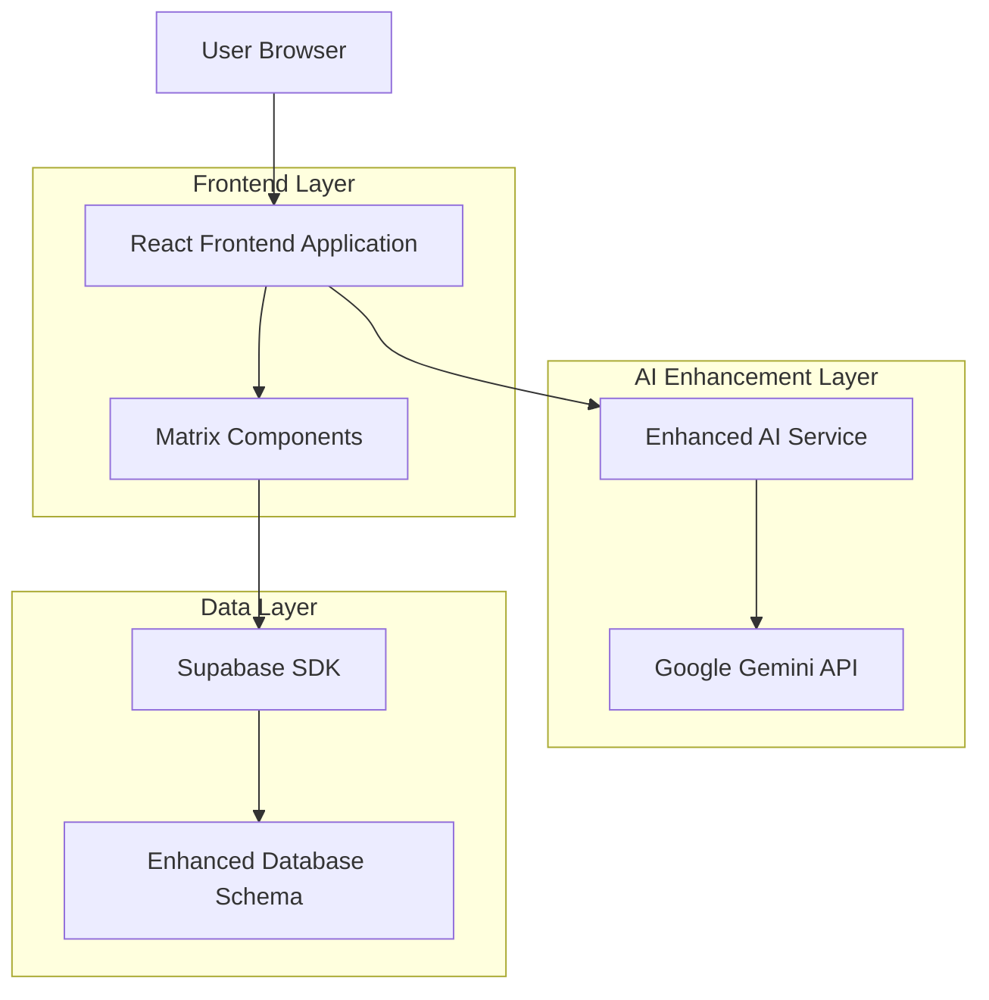
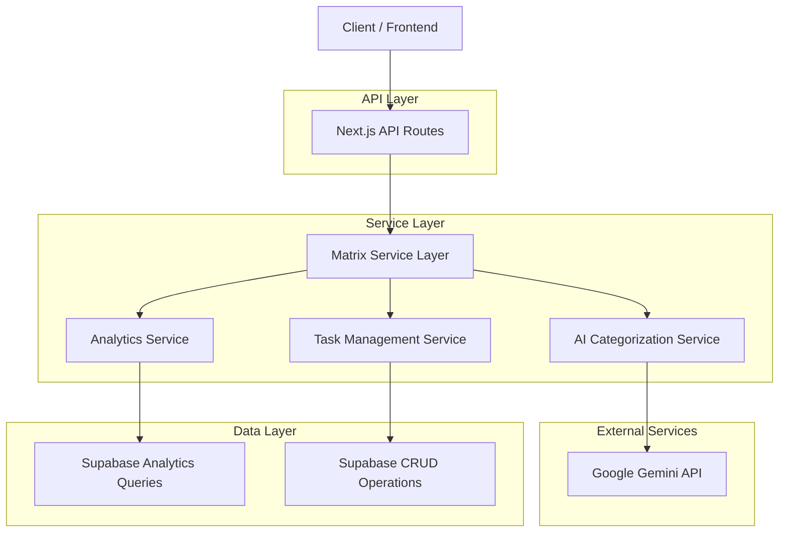
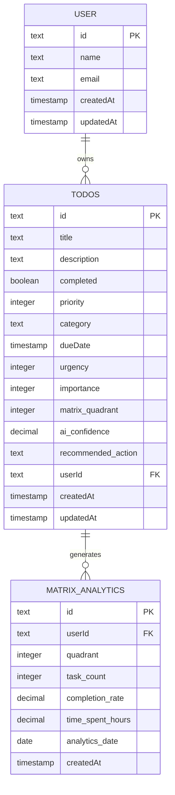

# Eisenhower Matrix Technical Architecture

## 1. Architecture Design



## 2. Technology Description

- Frontend: React@18 + TypeScript + Tailwind CSS + Framer Motion (for drag-and-drop animations)
- Backend: Next.js API Routes + Supabase
- AI Service: Google Gemini API via @ai-sdk/google
- Database: Supabase (PostgreSQL) with enhanced schema
- Additional Libraries: react-beautiful-dnd, recharts (for analytics), date-fns

## 3. Route Definitions

| Route | Purpose |
|-------|---------|
| /dashboard | Enhanced dashboard with matrix overview and quadrant distribution |
| /matrix | Full-screen Eisenhower Matrix view with drag-and-drop functionality |
| /analytics/matrix | Matrix-specific productivity analytics and insights |
| /tasks/create | Enhanced task creation with AI matrix categorization |

## 4. API Definitions

### 4.1 Enhanced AI Categorization API

**Matrix Categorization**
```
POST /api/ai/matrix-categorize
```

Request:
| Param Name | Param Type | Required | Description |
|------------|------------|----------|-------------|
| title | string | true | Task title for analysis |
| description | string | false | Detailed task description |
| dueDate | string | false | ISO date string for deadline analysis |
| context | object | false | Additional context (user preferences, work hours) |

Response:
| Param Name | Param Type | Description |
|------------|------------|-------------|
| urgency | number | Urgency level (1-3) based on time sensitivity |
| importance | number | Importance level (1-3) based on impact |
| quadrant | number | Calculated matrix quadrant (1-4) |
| confidence | number | AI confidence score (0-1) |
| reasoning | string | Explanation of categorization logic |
| recommendedAction | string | Quadrant-specific action guidance |
| estimatedTimeToComplete | string | AI estimate for task duration |

Example Response:
```json
{
  "urgency": 3,
  "importance": 2,
  "quadrant": 1,
  "confidence": 0.85,
  "reasoning": "High urgency due to tomorrow's deadline, moderate importance for quarterly goals",
  "recommendedAction": "DO - Schedule immediate focused work session",
  "estimatedTimeToComplete": "2-3 hours"
}
```

### 4.2 Matrix Analytics API

**Get Matrix Analytics**
```
GET /api/analytics/matrix
```

Query Parameters:
| Param Name | Param Type | Required | Description |
|------------|------------|----------|-------------|
| timeframe | string | false | 'week', 'month', 'quarter' (default: 'month') |
| includeCompleted | boolean | false | Include completed tasks in analysis |

Response:
```json
{
  "quadrantDistribution": {
    "1": { "count": 15, "percentage": 27 },
    "2": { "count": 25, "percentage": 45 },
    "3": { "count": 10, "percentage": 18 },
    "4": { "count": 5, "percentage": 9 }
  },
  "completionRates": {
    "1": 0.85,
    "2": 0.70,
    "3": 0.60,
    "4": 0.30
  },
  "timeAllocation": {
    "1": "40%",
    "2": "35%",
    "3": "20%",
    "4": "5%"
  },
  "trends": {
    "quadrant2Growth": "+15%",
    "quadrant1Reduction": "-8%"
  },
  "recommendations": [
    "Excellent progress! You've increased Quadrant 2 focus by 15%",
    "Consider delegating more Quadrant 3 tasks to reduce urgency pressure"
  ]
}
```

### 4.3 Enhanced Todo Operations

**Update Task Quadrant**
```
PATCH /api/todos/{id}/quadrant
```

Request:
| Param Name | Param Type | Required | Description |
|------------|------------|----------|-------------|
| quadrant | number | true | New quadrant (1-4) |
| urgency | number | false | Updated urgency level |
| importance | number | false | Updated importance level |
| reason | string | false | Reason for manual override |

**Bulk Quadrant Operations**
```
POST /api/todos/bulk-quadrant
```

Request:
| Param Name | Param Type | Required | Description |
|------------|------------|----------|-------------|
| taskIds | string[] | true | Array of task IDs |
| operation | string | true | 'move', 'delete', 'complete' |
| targetQuadrant | number | false | Target quadrant for move operation |

## 5. Server Architecture Diagram



## 6. Data Model

### 6.1 Enhanced Database Schema



### 6.2 Data Definition Language

**Enhanced Todos Table**
```sql
-- Add new columns to existing todos table
ALTER TABLE todos ADD COLUMN IF NOT EXISTS urgency INTEGER DEFAULT 1 CHECK (urgency IN (1, 2, 3));
ALTER TABLE todos ADD COLUMN IF NOT EXISTS importance INTEGER DEFAULT 1 CHECK (importance IN (1, 2, 3));
ALTER TABLE todos ADD COLUMN IF NOT EXISTS matrix_quadrant INTEGER DEFAULT 1 CHECK (matrix_quadrant IN (1, 2, 3, 4));
ALTER TABLE todos ADD COLUMN IF NOT EXISTS ai_confidence DECIMAL(3,2) DEFAULT 0.5;
ALTER TABLE todos ADD COLUMN IF NOT EXISTS recommended_action TEXT;
ALTER TABLE todos ADD COLUMN IF NOT EXISTS estimated_duration_minutes INTEGER;

-- Create performance indexes
CREATE INDEX IF NOT EXISTS idx_todos_matrix_quadrant ON todos(matrix_quadrant, userId, completed);
CREATE INDEX IF NOT EXISTS idx_todos_urgency_importance ON todos(urgency, importance, userId);
CREATE INDEX IF NOT EXISTS idx_todos_due_date_quadrant ON todos(dueDate, matrix_quadrant, userId);

-- Create function to auto-calculate quadrant
CREATE OR REPLACE FUNCTION calculate_matrix_quadrant(urgency_val INTEGER, importance_val INTEGER)
RETURNS INTEGER AS $$
BEGIN
    IF urgency_val >= 2 AND importance_val >= 2 THEN
        RETURN 1; -- Urgent & Important
    ELSIF urgency_val < 2 AND importance_val >= 2 THEN
        RETURN 2; -- Not Urgent & Important
    ELSIF urgency_val >= 2 AND importance_val < 2 THEN
        RETURN 3; -- Urgent & Not Important
    ELSE
        RETURN 4; -- Not Urgent & Not Important
    END IF;
END;
$$ LANGUAGE plpgsql;

-- Create trigger to auto-update quadrant
CREATE OR REPLACE FUNCTION update_matrix_quadrant()
RETURNS TRIGGER AS $$
BEGIN
    NEW.matrix_quadrant := calculate_matrix_quadrant(NEW.urgency, NEW.importance);
    RETURN NEW;
END;
$$ LANGUAGE plpgsql;

CREATE TRIGGER trigger_update_matrix_quadrant
    BEFORE INSERT OR UPDATE OF urgency, importance ON todos
    FOR EACH ROW
    EXECUTE FUNCTION update_matrix_quadrant();
```

**Matrix Analytics Table**
```sql
-- Create matrix analytics table for tracking productivity metrics
CREATE TABLE IF NOT EXISTS matrix_analytics (
    id TEXT PRIMARY KEY DEFAULT gen_random_uuid(),
    user_id TEXT NOT NULL REFERENCES users(id) ON DELETE CASCADE,
    quadrant INTEGER NOT NULL CHECK (quadrant IN (1, 2, 3, 4)),
    task_count INTEGER NOT NULL DEFAULT 0,
    completed_count INTEGER NOT NULL DEFAULT 0,
    completion_rate DECIMAL(3,2) NOT NULL DEFAULT 0.0,
    time_spent_hours DECIMAL(5,2) NOT NULL DEFAULT 0.0,
    analytics_date DATE NOT NULL DEFAULT CURRENT_DATE,
    created_at TIMESTAMP WITH TIME ZONE DEFAULT NOW(),
    updated_at TIMESTAMP WITH TIME ZONE DEFAULT NOW(),
    UNIQUE(user_id, quadrant, analytics_date)
);

-- Create indexes for analytics queries
CREATE INDEX idx_matrix_analytics_user_date ON matrix_analytics(user_id, analytics_date DESC);
CREATE INDEX idx_matrix_analytics_quadrant ON matrix_analytics(quadrant, analytics_date DESC);

-- Create view for matrix dashboard
CREATE OR REPLACE VIEW matrix_dashboard_view AS
SELECT 
    t.user_id,
    t.matrix_quadrant,
    COUNT(*) as total_tasks,
    COUNT(CASE WHEN t.completed = true THEN 1 END) as completed_tasks,
    ROUND(COUNT(CASE WHEN t.completed = true THEN 1 END)::DECIMAL / COUNT(*), 2) as completion_rate,
    AVG(t.ai_confidence) as avg_confidence,
    COUNT(CASE WHEN t.dueDate < NOW() AND t.completed = false THEN 1 END) as overdue_tasks
FROM todos t
WHERE t.created_at >= CURRENT_DATE - INTERVAL '30 days'
GROUP BY t.user_id, t.matrix_quadrant;
```

**Supabase Row Level Security (RLS) Policies**
```sql
-- Enable RLS on todos table
ALTER TABLE todos ENABLE ROW LEVEL SECURITY;

-- Policy for authenticated users to access their own todos
CREATE POLICY "Users can access their own todos" ON todos
    FOR ALL USING (auth.uid()::text = user_id);

-- Enable RLS on matrix_analytics table
ALTER TABLE matrix_analytics ENABLE ROW LEVEL SECURITY;

-- Policy for authenticated users to access their own analytics
CREATE POLICY "Users can access their own matrix analytics" ON matrix_analytics
    FOR ALL USING (auth.uid()::text = user_id);

-- Grant permissions
GRANT SELECT, INSERT, UPDATE, DELETE ON todos TO authenticated;
GRANT SELECT, INSERT, UPDATE, DELETE ON matrix_analytics TO authenticated;
GRANT SELECT ON matrix_dashboard_view TO authenticated;
```

## 7. Component Integration Architecture

### 7.1 State Management

```typescript
// Matrix Context for global state management
interface MatrixContextType {
  tasks: TaskWithMatrix[];
  quadrantDistribution: QuadrantDistribution;
  selectedQuadrant: number | null;
  draggedTask: TaskWithMatrix | null;
  updateTaskQuadrant: (taskId: string, quadrant: number) => Promise<void>;
  refreshMatrix: () => Promise<void>;
}

// Enhanced Task Type
interface TaskWithMatrix extends Todo {
  urgency: number;
  importance: number;
  matrix_quadrant: number;
  ai_confidence: number;
  recommended_action: string;
  estimated_duration_minutes?: number;
}
```

### 7.2 Real-time Updates

```typescript
// Supabase real-time subscription for matrix updates
const subscribeToMatrixUpdates = (userId: string) => {
  return supabase
    .channel('matrix-updates')
    .on(
      'postgres_changes',
      {
        event: '*',
        schema: 'public',
        table: 'todos',
        filter: `user_id=eq.${userId}`
      },
      (payload) => {
        // Update matrix state in real-time
        handleMatrixUpdate(payload);
      }
    )
    .subscribe();
};
```

This technical architecture provides a robust foundation for implementing the Eisenhower Matrix feature with scalable data management, real-time updates, and comprehensive analytics capabilities.